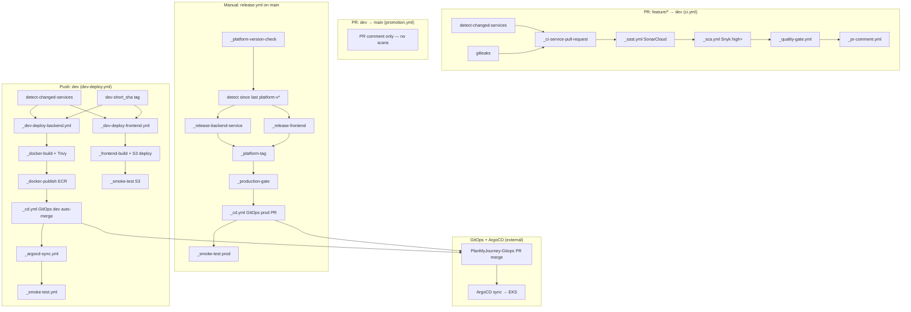

# CI/CD Architecture — Migration Plan & Reference

This document describes the redesigned CI/CD architecture for **PlanMyJourney-App** (monorepo) and **PlanMyJourney-Workflows** (reusable workflows only).

---

## 1. Migration Summary

### What changed

| Area | Before | After |
|------|--------|-------|
| App workflows | 6 per-service files + push to `main` deploys prod | 4 thin orchestrators: `ci.yml`, `dev-deploy.yml`, `promotion.yml`, `release.yml` |
| PR CI (`feature/* → dev`) | lint, sast, sca, **trivy/docker** per service | SonarCloud + Snyk + quality gate only (**no Docker on PR**) |
| Dev deploy | per-service push triggers | monorepo change detection; only changed services build/deploy |
| Dev image tags | `sha-<full-sha>` | `dev-<7-char-sha>` (e.g. `dev-a1b2c3d`) |
| Promotion (`dev → main`) | artifact-validation + scans | **approval-only** PR comment; no rescans |
| `main` push | auto prod pipeline | **nothing** — main is release-ready only |
| Production | auto on `main` push | **`workflow_dispatch` release** with version input |
| Prod image tags | promoted `sha-*` | per-service `vX.Y.Z` + platform tag `platform-vX.Y.Z` |
| Frontend dev | S3 + CloudFront (preserved) | unchanged delivery path |

### Repositories

| Repository | Role |
|------------|------|
| `Plan-My-Journey/PlanMyJourney-Workflows` | Reusable `workflow_call` templates only |
| `Plan-My-Journey/PlanMyJourney-App` | Thin caller workflows only |
| `Plan-My-Journey/PlanMyJourney-Gitops` | Helm values + ArgoCD apps (unchanged contract) |

### Push order after migration

1. `PlanMyJourney-Workflows` → `main`
2. `PlanMyJourney-App` → `dev` (then promote to `main`)
3. Configure branch protection (see §7)

---

## 2. Workflow Dependency Diagram



---

## 3. Trigger Matrix

| Workflow | File | Trigger | Branch / Event | Builds? | Deploys? |
|----------|------|---------|----------------|---------|----------|
| CI | `ci.yml` | `pull_request` | → `dev` | No | No |
| Dev Deploy | `dev-deploy.yml` | `push` | `dev` | Changed services only | Dev (GitOps + ArgoCD / S3) |
| Promotion | `promotion.yml` | `pull_request` | `dev` → `main` | No | No |
| Release | `release.yml` | `workflow_dispatch` | `main` + `version` input | Changed services only | Prod (after approval + GitOps) |
| ~~Per-service~~ | *(removed)* | — | — | — | — |

**Blocked flows (enforced by branch protection, not workflows):**

- `feature/*` → `main` (PR)
- Direct push → `dev`
- Direct push → `main`

---

## 4. Secrets Matrix

### PlanMyJourney-App

| Secret | Used by | Purpose |
|--------|---------|---------|
| `SONAR_TOKEN` | `ci.yml` | SonarCloud SAST |
| `SNYK_TOKEN` | `ci.yml` | Snyk SCA (high/critical gate) |
| `AWS_DEPLOY_ROLE_ARN_DEV` | `dev-deploy.yml`, `release.yml` | OIDC → AWS dev role |
| `AWS_DEPLOY_ROLE_ARN_PROD` | `dev-deploy.yml`, `release.yml` | OIDC → AWS prod role |
| `GITOPS_PAT` | `dev-deploy.yml`, `release.yml` | GitOps repo PRs |
| `ARGOCD_AUTH_TOKEN` | `dev-deploy.yml` | Optional explicit ArgoCD dev sync |
| `BREVO_API_KEY` | *(optional future notify)* | Email alerts |
| `NOTIFY_EMAIL` | *(optional future notify)* | Alert recipient |

### PlanMyJourney-Gitops

| Secret | Purpose |
|--------|---------|
| `ARGOCD_AUTH_TOKEN` | Prod ArgoCD sync on `values-prod.yaml` merge (`argocd-sync-on-merge.yml`) |

### PlanMyJourney-Workflows

No secrets stored — reusable workflows receive secrets from callers.

---

## 5. Variables Matrix

### PlanMyJourney-App

| Variable | Default | Purpose |
|----------|---------|---------|
| `AWS_REGION` | `us-east-1` | AWS region |
| `ARGOCD_SERVER` | `argocd.invest-iq.online` | ArgoCD hostname |
| `FRONTEND_BUCKET_DEV` | `ai-travel-frontend-dev` | Dev static hosting |
| `FRONTEND_BUCKET_PROD` | `invest-iq-online-frontend` | Prod static hosting |
| `CLOUDFRONT_DISTRIBUTION_ID_DEV` | `PLACEHOLDER` | Dev CDN (skip invalidation if placeholder) |
| `CLOUDFRONT_DISTRIBUTION_ID_PROD` | `E22TQX283Z4MH2` | Prod CDN |

---

## 6. Environment Matrix

| GitHub Environment | Used by | Purpose |
|--------------------|---------|---------|
| `dev` | `_docker-publish`, `_cd`, `_frontend-s3-deploy` when `deploy-environment=dev` | Dev AWS role + deploy context |
| `production` | `_production-gate`, `_cd` prod, `_docker-publish` prod, `_frontend-s3-promote` | Manual approval + prod AWS role |

---

## 7. Branch Protection Recommendations

### `dev`

- Require pull request before merging
- Require 1 approval
- Require conversation resolution
- Require branch up to date
- Require status checks:
  - `CI — Pull Request to dev` / matrix jobs (Sonar + Snyk + quality gate)
  - Optional: add required check names from SonarCloud GitHub integration
- **Block direct pushes**

### `main`

- Require pull request before merging (from `dev` only in practice)
- Require 1 approval
- Require conversation resolution
- Require branch up to date
- **Do not** require Sonar/Snyk on `main` PRs (promotion is approval-only)
- **Block direct pushes**

---

## 8. Tagging Strategy

| Environment | Format | Example | Stored in |
|-------------|--------|---------|-----------|
| Dev container | `dev-<7-char-sha>` | `dev-a1b2c3d` | ECR + `helm-charts/*/values-dev.yaml` |
| Dev frontend static | `dev-<7-char-sha>` | `dev-a1b2c3d` | S3 `.deployments/` |
| Prod container | `vX.Y.Z` | `v1.2.0` | ECR + `values-prod.yaml` + git tag `{service}-vX.Y.Z` |
| Platform release | `platform-vX.Y.Z` | `platform-v1.3.0` | Git tag on App repo |

**Independent service versioning:** each changed service in a release gets `vX.Y.Z` on its own ECR image; unchanged services keep existing prod tags.

---

## 9. Monorepo Service Map

| Service | Path filters | Runtime | Deploy type | ECR image | Helm chart | ArgoCD dev app |
|---------|--------------|---------|-------------|-----------|------------|----------------|
| frontend | `frontend/**`, `docker/frontend/**` | node | static (S3) | — | frontend | dev-frontend |
| user-service | `services/user-service/**`, `docker/user-service/**` | python | container | `ai-travel/user-service` | user-service | dev-user-service |
| travel-service | `services/travel-service/**`, `docker/travel-service/**` | python | container | `ai-travel/travel-service` | travel-service | dev-travel-service |
| utility-service | `services/utility-service/**`, `docker/utility-service/**` | python | container | `ai-travel/utility-service` | utility-service | dev-utility-service |
| ai-service | `services/ai-service/**`, `docker/ai-service/**` | python | container | `ai-travel/ai-service` | ai-service (+ ai-worker) | dev-ai-service |

**Docker build context:** `services/<service>/`  
**Production Dockerfile:** `docker/<service>/Dockerfile`

---

## 10. GitOps Deployment Flow

```
GitHub Actions → PlanMyJourney-Gitops (PR) → human merge (prod only) → ArgoCD → EKS
```

- **Dev:** `_cd.yml` auto-merges deploy PRs
- **Prod:** `_cd.yml` opens PR; operator merges; `planmyjourney-gitops` `argocd-sync-on-merge.yml` syncs `prod-*` apps
- **Never:** `kubectl apply`, `helm upgrade`, or direct cluster access from App workflows

---

## 11. Files Modified

### PlanMyJourney-Workflows (new)

| File | Purpose |
|------|---------|
| `.github/workflows/_detect-changed-services.yml` | Monorepo path diff → matrix JSON |
| `.github/workflows/_ci-service-pull-request.yml` | PR scan chain per service |
| `.github/workflows/_dev-deploy-backend.yml` | Dev backend build → ECR → GitOps → ArgoCD → smoke |
| `.github/workflows/_dev-deploy-frontend.yml` | Dev frontend S3 deploy → smoke |
| `.github/workflows/_platform-version-check.yml` | Validate `platform-vX.Y.Z` semver |
| `.github/workflows/_platform-tag.yml` | Create `platform-vX.Y.Z` git tag |
| `.github/workflows/_release-backend-service.yml` | Prod build/push/service tag |
| `.github/workflows/_release-frontend.yml` | Prod S3 promote + service tag |

### PlanMyJourney-Workflows (updated)

| File | Change |
|------|--------|
| `_sast.yml` | Added `fail-on-quality-gate` input; fails job when QG not OK |
| `_sca.yml` | Configurable threshold; default `high` for PR CI |
| `_quality-gate.yml` | Sonar QG + Snyk high/critical inputs |
| `_pr-comment.yml` | CI-focused summary (Sonar, Snyk, quality gate) |

### PlanMyJourney-App (new)

| File | Trigger |
|------|---------|
| `.github/workflows/ci.yml` | PR → `dev` |
| `.github/workflows/dev-deploy.yml` | push → `dev` |
| `.github/workflows/promotion.yml` | PR → `main` |
| `.github/workflows/release.yml` | `workflow_dispatch` on `main` |

### PlanMyJourney-App (removed)

| File | Reason |
|------|--------|
| `ai-service.yml`, `user-service.yml`, `travel-service.yml`, `utility-service.yml`, `frontend.yml`, `ai-worker.yml` | Replaced by monorepo orchestrators |

---

## 12. Workflow Triggers & Dependencies (Detailed)

### `ci.yml`

| Job | Needs | Reusable workflow | Notes |
|-----|-------|-------------------|-------|
| `detect-changes` | — | `_detect-changed-services` | base=PR base SHA, head=PR head SHA |
| `gitleaks` | — | inline | Full PR diff scan |
| `ci-scan` | detect, gitleaks | `_ci-service-pull-request` | Matrix per changed service |
| `no-changes` | detect | inline | Skip when nothing deployable changed |

### `dev-deploy.yml`

| Job | Needs | Reusable workflow | Notes |
|-----|-------|-------------------|-------|
| `detect-changes` | — | `_detect-changed-services` | base=`github.event.before`, head=SHA |
| `prepare-tag` | — | inline | Outputs `dev-<7-char-sha>` |
| `deploy-backend` | detect, prepare-tag | `_dev-deploy-backend` | Matrix `deploy-type=container` |
| `deploy-frontend` | detect, prepare-tag | `_dev-deploy-frontend` | If `frontend` in changed set |

### `promotion.yml`

| Job | Action |
|-----|--------|
| `promotion-note` | Posts PR comment; no security tools |

### `release.yml`

| Job | Needs | Action |
|-----|-------|--------|
| `guard-main` | — | Fail if not on `main` |
| `resolve-base` | guard | Last `platform-v*` tag → diff base |
| `version-check` | resolve-base | `_platform-version-check` |
| `detect-changes` | resolve-base, version-check | Services changed since last platform release |
| `release-backend` | detect, resolve-base | Matrix: build/push/tag `vX.Y.Z` |
| `release-frontend` | detect, resolve-base | S3 promote if frontend changed |
| `platform-tag` | release-* | `platform-vX.Y.Z` |
| `prod-approval` | platform-tag | GitHub `production` environment |
| `gitops-prod` | prod-approval, detect | `_cd.yml` prod PRs (manual merge) |
| `smoke-test-prod` | gitops-prod | `_smoke-test` against prod URLs |

---

## 13. Operational Notes

1. **First release:** with no `platform-v*` tags, change detection uses the initial commit as base (all services may build).
2. **Prod GitOps PRs** must be merged manually; ArgoCD prod sync runs from the GitOps repo workflow.
3. **`ARGOCD_AUTH_TOKEN`** on App repo is optional for dev (explicit sync skipped if unset); required on GitOps for prod sync.
4. **SonarCloud** project key remains `Plan-My-Journey_planmyjourney-app` (monorepo-wide project).
5. Run **Release** from Actions → **Release — Manual Production** on `main`, input e.g. `1.0.0`.

---

## 14. Validation Checklist

- [ ] Push `PlanMyJourney-Workflows` to `main`
- [ ] Open PR `feature/test → dev`; confirm Sonar + Snyk + PR comment, no Docker job
- [ ] Merge to `dev`; confirm only changed services deploy with `dev-*` tags
- [ ] Open PR `dev → main`; confirm promotion comment only, no scans
- [ ] Merge to `main`; confirm **no** deploy workflow runs
- [ ] Run `release.yml` with `1.0.0`; approve production gate; merge GitOps prod PRs; verify smoke tests
