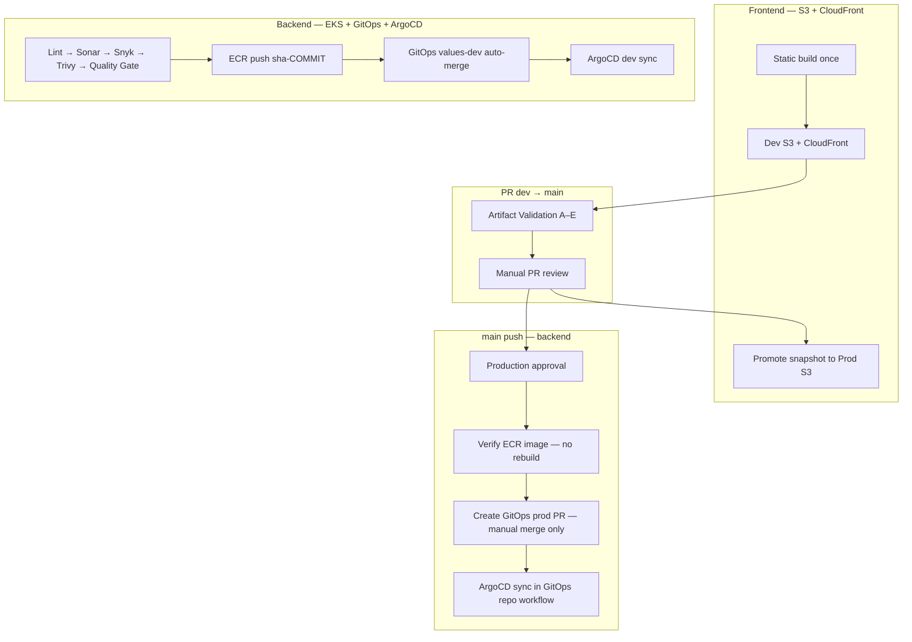

# Plan My Journey — CI/CD Setup Guide

Branch-based GitOps CI/CD with **build once, scan once, deploy many**.

| Layer | Deployment target |
|-------|-------------------|
| **Frontend** | S3 + CloudFront (dev and prod) |
| **Backend** | EKS + GitOps + ArgoCD |

| Branch | Environment | Trigger |
|--------|-------------|---------|
| `dev` | dev namespace / dev S3 | push |
| `main` | prod namespace / prod S3 | push (after PR from `dev`) |

---

## Architecture



---

## DEV branch push

### Backend service

```
lint → sast → sca → trivy → quality-gate
  → ECR push (tag: sha-$SHA)
  → GitOps values-dev.yaml (auto-merge PR)
  → ArgoCD sync dev-* apps
  → smoke test (fail hard)
  → record commit status ci/artifact-validated-{service}
```

### Frontend

```
lint → sast → sca → quality-gate
  → npm build once
  → S3 dev bucket + CloudFront invalidation
  → snapshot to s3://.../artifacts/sha-$SHA/
  → smoke test
  → record commit status ci/artifact-validated-frontend
```

---

## PR dev → main

```
artifact-validation (required status check)
  A. Image/static snapshot exists
  B. GitOps values-dev tag matches sha-$HEAD_SHA (backend)
  C/D. Dev ArgoCD Healthy+Synced OR dev frontend URL OK
  E. Commit status ci/artifact-validated-{service} = success
```

No Sonar, Snyk, Trivy, or Docker build on PR → main.

---

## MAIN branch push

### Backend

```
production-gate (GitHub environment approval)
  → read GitOps dev image tag
  → verify same sha-* image in ECR (no rebuild, no new tag alias)
  → create GitOps prod PR (NO auto-merge)
  → [human merges GitOps PR]
  → GitOps repo: argocd-sync-on-merge.yml
  → prod namespace
```

### Frontend

```
production-gate
  → promote static artifact dev S3 → prod S3 (same snapshot)
  → CloudFront invalidation
```

No GitOps or ArgoCD for production frontend.

---

## Terraform

| Event | Branch | Action |
|-------|--------|--------|
| PR | `dev` / `main` | plan only |
| push | `dev` | fmt → validate → plan → **apply** |
| push | `main` | fmt → validate → plan → **apply** (production approval) |

---

## GitHub Environments

### `dev`

- No required reviewers
- Dev ECR push, dev GitOps CD, dev ArgoCD sync, dev S3 deploy, terraform dev apply

### `production`

- **Required reviewers (1+)**
- Production gate, ECR verify/promote, GitOps prod PR creation, GitOps ArgoCD sync workflow, prod S3 promote, terraform prod apply

---

## Branch Protection

### `dev`

| Rule | Setting |
|------|---------|
| Require pull request | ✅ |
| Required status checks | lint, SonarCloud Scan, sca, build (Trivy) |
| Require up-to-date branch | ✅ recommended |

Quality Gate runs on **push to dev** (deploy pipeline), blocking ECR/S3 if scans fail.

### `main`

| Rule | Setting |
|------|---------|
| Require pull request from `dev` | ✅ ruleset |
| Required approvals | ≥ 1 |
| Required status checks | **Artifact Validation** (per changed service workflow) |
| Block direct push | ✅ |

---

## Secrets and Variables

### `PlanMyJourney-App`

| Secret | Purpose |
|--------|---------|
| `SONAR_TOKEN` | SonarCloud |
| `SNYK_TOKEN` | Snyk |
| `GITOPS_PAT` | GitOps PR create (dev auto-merge only) |
| `ARGOCD_AUTH_TOKEN` | Dev artifact validation + dev ArgoCD sync |
| `AWS_DEPLOY_ROLE_ARN_DEV` | Dev AWS OIDC |
| `AWS_DEPLOY_ROLE_ARN_PROD` | Prod AWS OIDC |
| `BREVO_API_KEY` | Email alerts |
| `NOTIFY_EMAIL` | Alert recipient |

| Variable | Example |
|----------|---------|
| `AWS_REGION` | `us-east-1` |
| `ARGOCD_SERVER` | ArgoCD hostname |
| `FRONTEND_BUCKET_DEV` | `ai-travel-frontend-dev` |
| `FRONTEND_BUCKET_PROD` | `ai-travel-frontend-prod` |
| `CLOUDFRONT_DISTRIBUTION_ID_DEV` | From Terraform output |
| `CLOUDFRONT_DISTRIBUTION_ID_PROD` | `E22TQX283Z4MH2` |

### `PlanMyJourney-Gitops`

| Secret | Purpose |
|--------|---------|
| `ARGOCD_AUTH_TOKEN` | Prod ArgoCD sync after GitOps merge |

| Variable | Purpose |
|----------|---------|
| `ARGOCD_SERVER` | ArgoCD hostname |

---

## Reusable Workflows

| File | Purpose |
|------|---------|
| `_artifact-validation.yml` | PR → main gate (A–E) |
| `_record-artifact-validation.yml` | Commit status after dev smoke test |
| `_cd.yml` | GitOps PR; **dev auto-merge only** |
| `_docker-promote.yml` | Verify ECR image; reuse same `sha-*` tag |
| `_frontend-s3-deploy.yml` | Dev/prod S3 + artifact snapshot |
| `_frontend-s3-promote.yml` | Promote static artifact dev → prod |
| `_smoke-test.yml` | Fail-hard HTTP checks |

---

## GitOps Repository Workflow

`planmyjourney-gitops/.github/workflows/argocd-sync-on-merge.yml`

- Triggers on push to `main` when `values-prod.yaml` changes
- Runs **after human merges** deploy PR
- Syncs only changed `prod-*` ArgoCD apps
- Skips `prod-frontend` (S3 + CloudFront)

---

## Operational Notes

1. Run at least one successful **dev deploy** per service before first PR to `main`.
2. Production GitOps PRs are **never auto-merged** — assign a reviewer in GitOps repo.
3. Prod backend uses the **exact same `sha-*` tag** as dev (same digest).
4. Consider disabling or removing `prod-frontend` ArgoCD app (orphaned after S3 migration).
5. Push order: **PlanMyJourney-Workflows** → **PlanMyJourney-App** → **PlanMyJourney-Gitops**.
